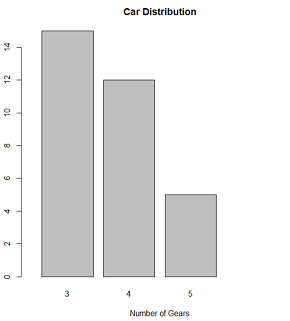
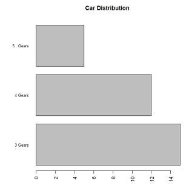
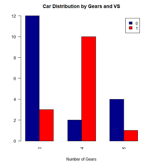
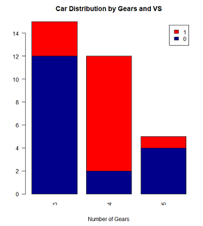
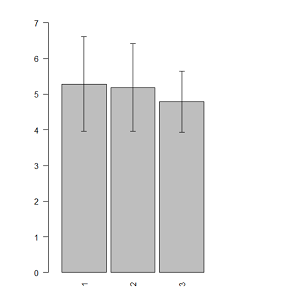
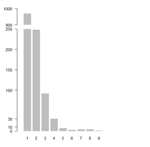
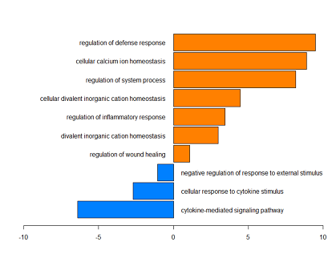

# barplot的各种不同形式
> 参考 Quick-R: http://www.statmethods.net/graphs/bar.html

## 简单情况

### 基本图形
```
counts <- table(mtcars$gear)
barplot(counts, main="Car Distribution", xlab="Number of Gears")
```

  

然而，图中bar太宽，需要调窄一点，这需要配合参数`xlim`

```
barplot(counts, main="Car Distribution", xlab="Number of Gears",
        xlim= c(0, 5)
        )
```



bar图水平放置，需要设置`horiz= TRUE`，另外配合使用参数`las`改变每个bar标签的方向

```
barplot(counts, main="Car Distribution", horiz=TRUE, las= 1,
        names.arg=c("3 Gears", "4 Gears", "5 Gears"))
```


默认情况下，barplot并不会画bar的分类坐标，我们可以使用`axis.lty= 1`显示出来；另外，控制标签的大小使用`cex.names`参数，我们还可以用`par`控制画布的位置

```
par(las=2) # make label text perpendicular to axis
par(mar=c(5,8,4,2)) # increase y-axis margin.
counts <- table(mtcars$gear)
barplot(counts, main="Car Distribution", horiz=TRUE, names.arg=c("3 Gears", "4 Gears", "5   Gears"), cex.names=0.8)
```



### 分组
其实就是将数据变换了格式，然后通过`beside`参数控制

```
counts <- table(mtcars$vs, mtcars$gear)
barplot(counts, main="Car Distribution by Gears and VS",
  xlab="Number of Gears", col=c("darkblue","red"),
 	legend = rownames(counts), beside=TRUE)
```



### 重叠（stacked）
没有加参数`beside= TRUE`

```
counts <- table(mtcars$vs, mtcars$gear)
barplot(counts, main="Car Distribution by Gears and VS",
  xlab="Number of Gears", col=c("darkblue","red"),
 	legend = rownames(counts))
```



### 加标准误差
需要通过`arrow`画箭头的参数来拼接

```
# 数据构造
tbl <- data.frame(groups= sample(rep(1:3, 100), 30),
                  scores <- rnorm(30, 5)
)
# 计算每组的均值和标准误
mean_tbl <- aggregate(scores ~ groups, tbl, mean)
sd_tbl <- aggregate(scores ~ groups, tbl, sd)
# 绘图,同时设计bar的间隔
space = 0.1
barplot(mean_tbl[, 2], xlim= c(0, 5), ylim= c(0, 7), space= space, names= 1:3)
# 计算每一个bar的中心位置
grp <- nrow(mean_tbl)
x_loc <- 0.5*(1 + seq(from= 0, by= 2, length.out= grp))  + space*seq_len(grp)
# 标准误作图
arrows(x0=x_loc, x1= x_loc, y0= mean_tbl[, 2], y1= mean_tbl[, 2] + sd_tbl[, 2], angle= 90, length= .05)
arrows(x0=x_loc, x1= x_loc, y0= mean_tbl[, 2], y1= mean_tbl[, 2] - sd_tbl[, 2], angle= 90, length= .05)
```



### bar图截断
*该图可以利用`plotrix::gap.barplot`绘制*
有时候某个bar太长，影响了整体性，这时候就需要截断

```
mat <- c(969, 248, 92, 30, 7, 3, 4, 4, 1)
# 如果要达到缩短第一个bar凸显其他bar的话，需要以矩阵的形式截断输入
m0 <- mat
m0[1] <- 250
m1 <- c(10, rep(0, 8))
# 设计好截断比例
m2 <- c(69*40/100, rep(0, 8))
mat <- matrix(c(m0, m1, m2), nrow= 3, byrow= T)
mat
# 绘图
barplot(mat, col= c("grey", "white", "grey"), border= T, axes= T,
        ylim= c(0, 300), xlim= c(0, 17), names.arg= 1:9
)
# 可以看出我们构造的图纵坐标不对，所以要对坐标重新构造；且border也要去掉才行
barplot(mat, col= c("grey", "white", "grey"), border= F, axes= F,
        ylim= c(0, 300), xlim= c(0, 17), names.arg= 1:9
)
axis(2, at= c(0, 10, 30, 100, 150, 200, 250), labels= c(0, 10, 30, 100, 150, 200, 250), las= 1)
axis(2, at= c(260, 300), labels= c(900, 1000), las= 1)
```



另一个相似的例子

```
m0 <- c(172, 24, 15, 5, rep(0, 5))
m1 <- c(78, 224, 77, 25, 7, 3, 4, 4, 1)
m2 <- c(10, rep(0, 8))
m3 <- c(34, rep(0, 8))
mat <- matrix(c(m0, m1, m2, m3), 4, byrow= T)
barplot(mat, ylim= c(0, 300), col= c("black", "grey", "white", "grey"), 
        border= F, xlim= c(0, 17), xlab= "no. circRNAs", ylab= "no. hosts", 
        names.arg= 1:9, axes= F)
axis(2, at= c(0, 10, 30, 100, 150, 200, 250), labels= c(0, 10, 30, 100, 150, 200, 250), las= 1)
axis(2, at= c(260, 300), labels= c(900, 1000), las= 1)
```

### 对称bar图
这种图经常见到，但使用基础函数绘制需要一定的技巧

```
# 构造数据
set.seed(4)
qvalue <- sort(rnorm(10, mean= 0, sd= 5))
labels <- c("cytokine-mediated signaling pathway",
"cellular response to cytokine stimulus",
"negative regulation of response to external stimulus",
"regulation of wound healing",
"divalent inorganic cation homeostasis",
"regulation of inflammatory response",
"cellular divalent inorganic cation homeostasis",
"regulation of system process",
"cellular calcium ion homeostasis",
"regulation of defense response"
)
tbl <- data.frame(qvalue, labels)
# 参数计算
LIM <- round(max(abs(qvalue))) + 1 #设置坐标范围
SPACE <- 0.1 #设置bar图间距
L <- length(qvalue)
AXIS <- rev(seq(0, L-1) + seq(L)*0.1 + 0.5) #计算bar图label的坐标
new_tbl <- data.frame(tbl, rev(AXIS))
# 绘图
barplot(qvalue, horiz= TRUE, xlim= c(- LIM, LIM), space= SPACE, 
        col= c(rep("#0080FF", sum(qvalue < 0)), rep("#FF8000", sum(qvalue > 0)))
)
axis(side= 2, pos= 0, at= new_tbl[qvalue > 0, 3], labels= new_tbl[qvalue > 0, 2], las= 2, tick= FALSE)
axis(side= 4, pos= 0, at= new_tbl[qvalue < 0, 3], labels= new_tbl[qvalue < 0, 2], las= 2, tick= FALSE)
```



